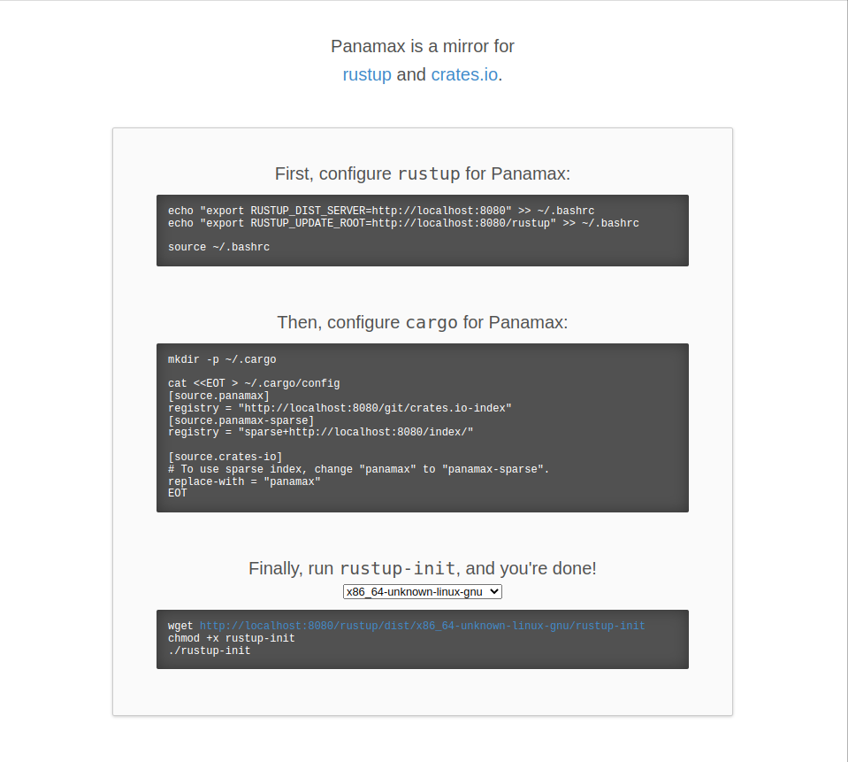

# Rust Registry offline

Run your own crate registry offline for Rust. Get instructions to download and push crates. Perfect for long plane trips ! :airplane:



Pre-requisite :

- Docker
- Docker-compose

Using :

- [Panamax](https://github.com/panamax-rs/panamax) (the actual registry)
- [Zerus](https://github.com/wcampbell0x2a/zerus) (to download binary crates)

## Retrieve server files (online)

1. Build and init the server

    ```bash
    docker-compose build
    docker-compose -f init.docker-compose.yml run registry_init
    ```

2. Replace default values

    :information_source: Before running this command, you might want to check `./mirror/mirror.toml`'s content

    ```bash
    cp ./mirror.example.toml ./mirror/mirror.toml
    ```

3. Run server sync to retrieve base crates

    To download the FULL mirror of _crates.io_ :

    > **Note**
    > Downloading the full mirror takes around 1 hour to download on a fiber connection and uses ~119GB of storage

    ```bash
    docker-compose -f sync.docker-compose.yml run registry_sync sync /mirror
    ```

    For an empty mirror that can later be populated :

    ```bash
    docker-compose -f sync.docker-compose.yml run registry_sync sync /mirror /vendor
    ```

4. Now export server's docker image and zip this project to copy it on your offline computer

    ```bash
    docker save -o panamax_registry:latest panamax_registry.tar
    zip -r rust-registry-offline.zip ./*
    ```

## Setup the offline server (offline)

1. Load server's docker image and unzip the project

    ```bash
    docker load -i panamax_registry.tar
    unzip -d rust-registry-offline rust-registry-offline.zip
    cd rust-registry-offline
    ```

2. Start the server

    ```bash
    docker-compose up -d
    ```

    Check server is running browsing `http://localhost:8080`

## Download crates (online)

Pre-requisite : [rust and cargo must be installed on your computer](https://www.rust-lang.org/tools/install)

Let's say you want to download [Huggingface's text-generation-inference](https://github.com/huggingface/text-generation-inference) crates.

1. Install [zerus](https://github.com/wcampbell0x2a/zerus) to download binary crates

    > **Note**
    > Crates must be downloaded from a computer running the same [hardware platform](https://doc.rust-lang.org/nightly/rustc/platform-support.html) than your target clients.

    ```bash
    cargo install zerus --locked
    ```

2. Clone the project to mirror

    The directory must include a `Cargo.toml` and `Cargo.lock` files.

    ```bash
    git clone https://github.com/huggingface/text-generation-inference && cd text-generation-inference
    ```

3. Download crates

    ```bash
    zerus package-mirror ./Cargo.toml
    ```

4. Zip crates to copy them to your offline computer

    ```bash
    zip -r "mycrates.zip" ./package-mirror/crates/*
    ```

## Push the crates (offline)

This procedure requires write access to the `./mirror` directory of the actual server you're exposing. It does NOT work with `cargo publish` but with the following commands. You might want to include it in a CI pipeline for your users to push packages.

1. Unzip crates into the `crates/` directory

    ```bash
    zip -d "./crates/$(date +%s)/" "mycrates.zip"
    ```

2. Push crates

    ```bash
    docker-compose -f push.docker-compose.yml run --rm push
    ```
